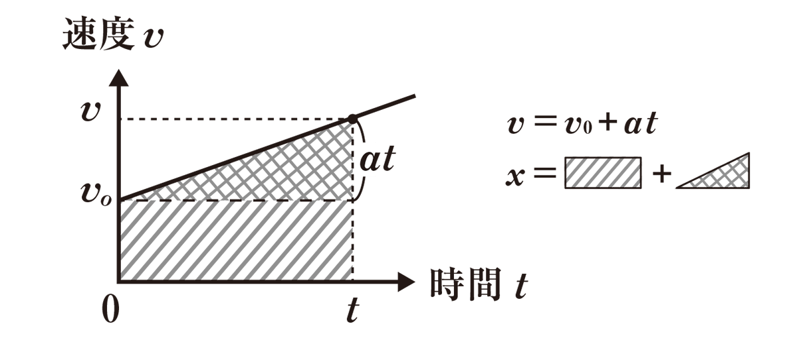
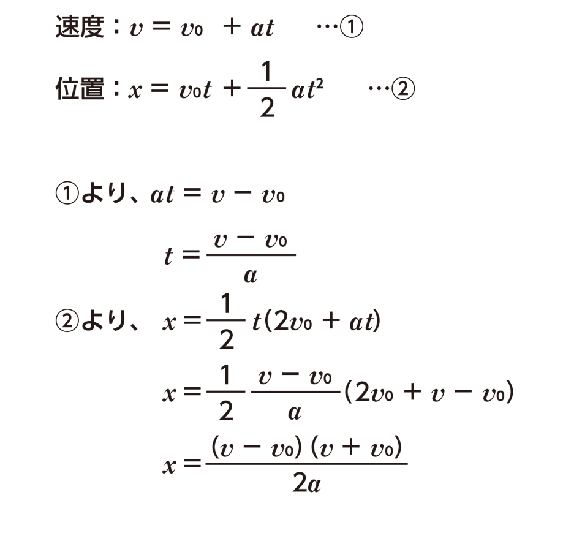
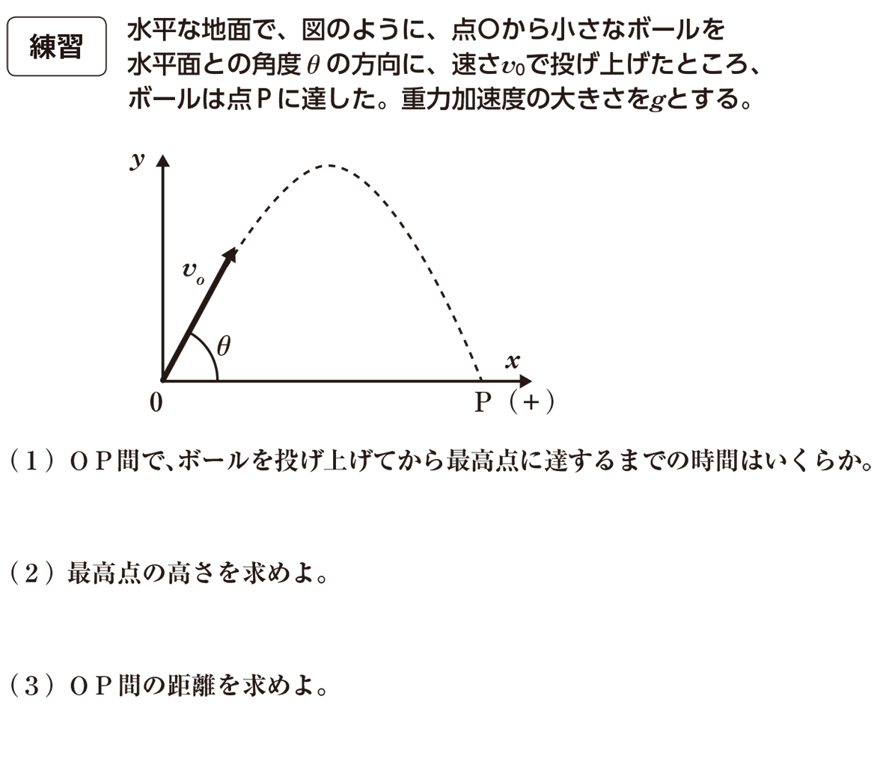
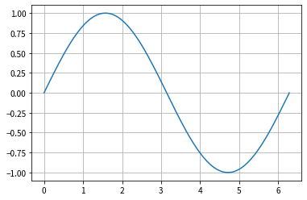
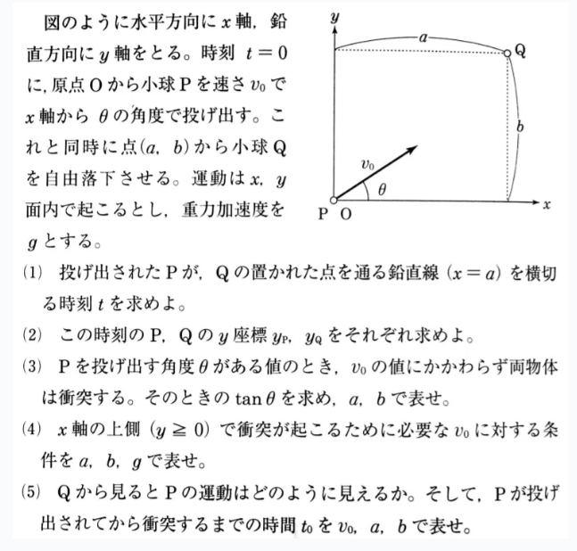

# 力学の原理  
## ニュートンの運動方程式　

## $$\\ m\vec{a}=\vec{F}$$
<p style="font-size:8px">※ベクトルは方向を伴う大きさの単位</p>  

例として  
「動いている物体の力は質量と加速度に比例する」  
「物体の動き(加速度)は、力の大きさに比例し、質量に反比例する」など

## 等加速度直線運動
一定の加速度で運動する物体は以下を満たす

位置$x$  
速度$V$  
初速度$V_0$  
加速度$\alpha$  
時間$t$ とすると

1．$ V = V_0 + at $  
2．$ x = x_0 + V_0t + \frac{1}{2}at^2 $  
3．$V^2 - V_0^2 = 2a(x - x_0)$

<b>1.  初速に加速度と時間の積を加えると速度が求められる</b>

<b>2.  初期位置に初速度と時間の積(距離)を加えた位置から,さらに加速度分の距離を追加すると位置が求められる</b>  


上記グラフの面積を求めると距離が求められる  

積分を使った解法として  
速度を表す関数$v$を$t(時間)$で積分する  
$$x = \int vdt $$  

$$ = V_0t + \frac{1}{2}at^2 + C_2 $$  

時間が0の時の位置は初期位置$x_0$となるため  
$t = 0$の時$x = x_0$を上式に代入して$C_2 = x_0$が求められる

よって $$ x = x_0 + V_0t + \frac{1}{2}at^2 $$

 <b>3.    1-2の連立方程式で時間を消す</b>  
   
 
 よって  
 $$V^2 - V_0^2 = 2a(x - x_0)$$

#### 基本問題


<b>問題に入る前に2次元の問題は1次元に分解して情報を整理する</b>  


<b>1. 初速度$V_0$の分解</b>  
三角関数を使い$V_0$をx成分、y成分に分解する  
$ \sin\theta =  V_0x$ より $ x = V_0\cos\theta$  
$ \cos\theta =  V_0y$ より $ y = V_0\sin\theta$

<b>2. $\vec F$の分解</b>  
ボールにかかる力は重力$mg$(質量m×重力加速度g)  
→Y軸上のみ、ボール(m)に対して-gの加速度が生じる  
<span style="font-size:8px">重力加速度:gは通常$9.8m/s^2$</span> 

X軸上は力の作用はない

<b>3.運動方程式を立てる</b>  
$m\vec{a} = \vec{F}$より  


$m\vec{a_x} = \vec{F_x} $  
$m\vec{a_y} = \vec{F_y} $  

ベクトルが等しいという事大きさと方向が等しい  
方向が等しいためX,Y成分に分解しても大きさは等しい

ボールに加わる力はy成分に対する重力のみ  
$ma_x = 0$(X軸)  
$ma_y = -mg$(Y軸)  
$a_x = 0$　　$a_y = -g$　となる  
加速度aが0の場合、物体は等速直線運動を行う  
加速度aが一定(定数)場合、物体は等加速度直線運動を行う


<b>よってボールは  
>X軸方向には初速度$V_0\cos\theta$の等速直線運動を行い、  
>Y軸方向には初速度$V_0\sin\theta$の鉛直投げ上げ運動をする</b>

<b>これまでの内容から斜方投射の方程式が説明できる</b>  
>[X軸上]  
>①$V_x = V_0\cos\theta$   
>②$x = V_0\cos\theta t$（X軸上は等速直線運動を行っているため)


>[Y軸上]  
>③$V_y = V_0\sin\theta-gt $(Y軸上は重力加速度によって初速から時間と共に減速する)  
>④$y = V_0\sin\theta t - \frac{1}{2}gt^2$($初期位置y_0＝0と加速度α＝-g$を代入)  
>⑤$V_y^2 - V_0^2\sin^2\theta = -2gy$($初速V_0と加速度αと初期位置y_0を代入$)


<b>(1)最高点に到達するまでの時間はいくらか？</b> 


<b>最高点ではY軸方向の速度が0になる</b>  
よって速度$V_y = 0$  


ボールにかかる力$ \alpha_y = -g $  
初速$ V_0y = V_0\sin\theta$

①より  
$V_y = V_0y - \alpha t$  
$0 = V_0\sin\theta -gt$  


>答え・・・最高到達点までの時間は$ \frac{V_0\sin\theta}{g} $

(2)最高点はいくらか？

位置を求める式  $$ y = y_0 + V_0t + \frac{1}{2}at^2 $$  
に(1)の解t=...を代入してもいいが、計算が長くなる…

(1)と同じくY軸方向の速度$V_y = 0$の時  
⑤より  
$-V_0^2\sin^2\theta = -2gy$(この時、位置$y$が最高値となる)  


>答え・・・最高到達点は$ \frac{V_0^2\sin^2\theta}{2g}$

<b>(3)OP(水平到達距離)はいくらか</b>  


水平距離はX軸上の話だが、投射から落下という現象はY軸上でしか表現できない  


<b>ボールが初期位置y=0から頂点に達し、再び$y=0$となるまでの時間tを求める</b>  

④より  
$ 0 = V_0\sin\theta t -\frac{1}{2}gt^2$ 

$ t^2 - \frac{2V_0\sin\theta t}{g} = 0$  
$t(t - \frac{2V_0\sin\theta}{g}) = 0$
<span style="font-size:8px">この形（$x(x-a) = 0$ で $x = 0,-a$と同じ形なので）</span>  

$t=0 , \frac{2V_0\sin\theta}{g} $  

<b>ボールの位置がY軸上で0となる時間は　0,　$\frac{2V_0\sin\theta}{g}$となる</b>  
解が2つあるのは、最初の地点と落下地点の2点で$y = 0$を示すから…素晴らしい…  


よって、X軸上で$t=\frac{2V_0\sin\theta}{g}$の等速直線運動を行う場合の到達距離Xは②より  


$x = \frac{V_0\cos\theta × 2V_0\sin\theta}{g}$  

$x = \frac{V_0^2}{g}2\sin\theta\cos\theta$  

倍角の公式より($\sin 2\theta = 2\sin\theta \cos\theta$)  

$ x = \frac{V_0^2}{g}\sin2\theta$

>答え・・・OP(水平到達距離)は$ \frac{V_0^2}{g}\sin2\theta$

<b>ちなみに最も水平到達距離が大きくなる時の角度$\theta$は…</b>

$V_0$と$g$は定数と考えると$\sin2\theta$が最大を示す角度となる


```python
import matplotlib.pyplot as plt
import numpy as np
import sympy as sym
from sympy.plotting import plot
sym.init_printing(use_unicode=True)
%matplotlib inline
a, b, c, x, y = sym.symbols("a b c x y")
plt.rcParams['font.family'] = 'Noto Sans JP'

x = np.linspace(0, 2*np.pi, 500)

plt.plot(x,np.sin(x))
plt.grid(True)
plt.show()
```


    

    


$\sin$の最大値は1のため  
$\sin2\theta = 1$の時 $2\theta = 90°$  
よって
$\theta =45° $

><b>ボール投げで水平到達距離が最も大きくなる投射角度は45°</b>  
<span style="font-size:8px">実際は空気抵抗があるので、39°～40°くらいが最適らしい</span>

<b>(4)軌道の方程式$f(x)$を求めよ</b>  

xとyの関係 $y=f(x)$ の形にする  

②より  
$x = V_0\cos\theta t$  
$t = \frac{x}{V_0\cos\theta}$  
④に代入  
$y = V_0\sin\theta \frac{x}{V_0\cos\theta} - \frac{1}{2}g (\frac{x}{V_0\cos\theta})^2$  
$y = \sin\theta \frac{x}{\cos\theta} - \frac{1}{2}g \frac{x^2}{V_0^2\cos^2\theta}$  
$y = \frac{\sin\theta}{\cos\theta}x -  \frac{g}{2V_0^2\cos^2\theta}x^2$  

(三角関数より$\frac{\sin\theta}{\cos\theta} = \tan\theta$)  

$y =  -\frac{g}{2V_0^2\cos^2\theta}x^2 + \tan\theta x$  ($y=ax^2+bx+c$の形)  


>答え・・・$f(x) = y =  -\frac{g}{2V_0^2\cos^2\theta}x^2 + \tan\theta x$

$a < 0 $より
<b>$f(x)$は上に凸な放物線を描く二次関数である</b>

そのため頂点のy座標は$f(x)$の平方完成で求められ、その解は(2)の解$ \frac{V_0^2\sin^2\theta}{2g}$と一致するはず…  

つまり$f(x)$を平方完成すると
$$ y =  -\frac{g}{2V_0^2\cos^2\theta}(x - \frac{V_0^2\sin^2\theta}{2g})^2 + q $$の形になる  

見た感じ正しそうだが、長くなりそうなので計算はしない

#### 応用問題：モンキーハント  


<b><情報の整理></b>
    
図では(a,b)の表記だが、αと被るので(L,H)とする

<b>初速度$V_0$の分解</b>  
$ V_x = V_0\cos\theta$  
$V_y = V_0\sin\theta$

<b>小球Pにかかる力</b>  
Y成分：$\vec{F} = -mg$  
X成分：$\vec{F} = 0$

<b>運動方程式</b>  
$m\vec{a} = \vec{F}$ より 

$m\vec{a_y} = -mg$  
$ a_y = -g$

$m\vec{a_x} = 0$  
$ a_x = 0$
 
<b>よって小球Pは 
>X軸方向には初速度$V_0\cos\theta$の等速直線運動を行い、  
>Y軸方向には初速度$V_0\sin\theta$の鉛直投げ上げ運動をする</b>

>[X軸上]  
>①$V_x = V_0\cos\theta$   
>②$x = V_0\cos\theta t$


>[Y軸上]  
>③$V_y = V_0\sin\theta-gt $  
>④$y = V_0\sin\theta t - \frac{1}{2}gt^2$    
>⑤$V_y^2 - V_0^2\sin^2\theta = -2gy$
    
    

また自由落下する小球Qにおいて　　


初速$V_0q = 0$  

<b>小球Qにかかる力</b>  
Y成分：-mg(重力)  
$m\vec{a} = \vec{F}$より    
$ma = -mg$  
$a = -g$  

<b>よって小球Qは</b>
>初期位置(L,H)からY軸方向に初速$V_0=0$、加速度$a=-g$の自由落下運動を行う  
>⑥$V_y = -mt$  
>⑦$y = H  - \frac{1}{2}gt^2$  
>⑧$V_y^2 = -2gy$

<b>(1)Pが$x=L$を通る時刻tを求めよ</b>  
①より  
$L = V_0\cos\theta t$  
$t = \frac{L}{V_0\cos\theta} $  

>答え・・・$t = \frac{L}{V_0\cos\theta} $

<b>(2)この時刻tの時の、小球P,Qのy座標$(y_p,y_q)$を求めよ</b> 

$y_p$について  
小球Pに生じるY軸上の加速度は-g  
また④より  
>答え1・・・$y_p = V_0\sin\theta t - \frac{1}{2}gt^2$  


また$y_q$について⑦より  
>答え2・・・$y_q = H - \frac{1}{2}gt^2$

<b>(3)$V_0$に関わらず、P,Qが衝突する角度$\theta$の値について、$\tan\theta$を求める</b>


<b>P($x_p,y_p$)とQ($a,y_q$)が一致すれば衝突する</b>  

小球Pにおいて  
(1)の解と②より、Pが$x=L$を通る時刻tのx座標($x_p$)は  
$x_p = L$

この時（2）の解より  
$y_p = V_0\sin\theta t - \frac{1}{2}gt^2$  


よってPが$x = L$上を通る際の座標($x_p,y_p$)は  
>$(L,V_0\sin\theta t - \frac{1}{2}gt^2)$


また(2)の解より、この時小球Qのy座標は  
$(L, H - \frac{1}{2}gt^2)$  

$y_p = y_q$となる$\theta$を求める  
 

$V_0\sin\theta t - \frac{1}{2}gt^2 = H - \frac{1}{2}gt^2$

この時(1)より$ t = \frac{L}{V_0\cos\theta}$ 

$V_0\sin\theta \frac{L}{V_0\cos\theta} - \frac{1}{2}g(\frac{L}{V_0\cos\theta})^2 = H - \frac{1}{2}g(\frac{L}{V_0\cos\theta})^2$

$ \frac{V_0\sin\theta}{V_0\cos\theta}L - \frac{L^2}{2V_0^2\cos^2\theta}g = H - \frac{L^2}{2aV_0^2\cos^2\theta}g$


$\tan\theta L = H$  
>答え・・・$\tan\theta = \frac{H}{L}$

<b>$\tan\theta=\frac{H}{L}$となる角度$\theta$とは、小球Qが自由落下を開始する地点とX軸との成す角となる</b>

<b>マジで信じられないが、どんな初速度で小球Pを発射しようとも、小球Qの最初の地点を目標に向けて発射すれば、命中する。マジで信じられん</b>

### 参考サイト  
- [家庭教師のトライ 斜方投射の立式に関する問題](https://www.try-it.jp/chapters-8001/sections-8036/lessons-8062/practice-3/)  
  
- [高校の力学を全部解説する授業(前編)【物理】](https://www.youtube.com/watch?v=9XEX4mZFOhA)
