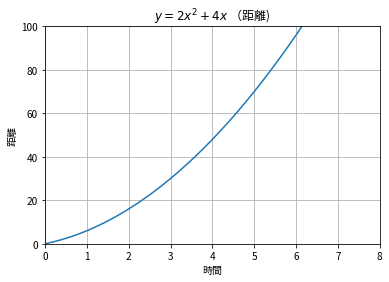
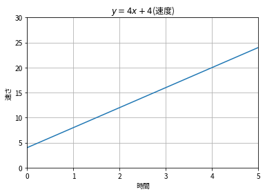
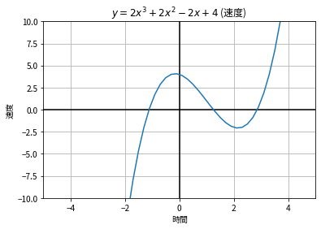
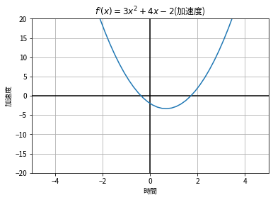
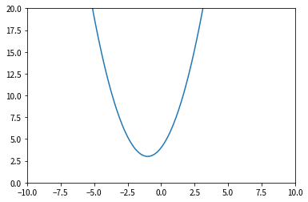

## 距離・速度・加速度を例にしてみる  


### <strong>微分の復習</strong>  
距離をY、時間をXとして以下に従って運動する場合


$$ f(x) = 2x^2 + 4x  \\ $$


```python
import pandas as pd
import numpy as np
import matplotlib.pyplot as plt
import sympy as sym
from sympy.plotting import plot
sym.init_printing(use_unicode=True)
%matplotlib inline
# シンボルを登録
a, b, c, x, y = sym.symbols("a b c x y")
plt.rcParams['font.family'] = 'Noto Sans JP'
```


```python
N = 1000
xmin = 0
xmax = 100
def f(x):
    if x < 0:
        return 0
    else:
        return 2 * x**2 + 4 * x

p = np.linspace( xmin, xmax, N)

fig, ax = plt.subplots()
ax.plot( p, [f(p[k]) for k in range(N)] )

ax.set_xlim(0, 8)
ax.set_ylim(0, 100)
ax.grid(True)

plt.title("$ y = 2x^2 + 4x $ （距離)")
plt.xlabel("時間")
plt.ylabel("距離")
plt.show()
```


    

    


距離のグラフが描けた
$$ f(x) = 2x^2 + 4 x $$

これを微分して速度を求める導関数を出す  
時間がtのとき、速度は $ [t , f(t)] $を通る接線の傾きと一致する


$$ f'(x) = \frac{d}{dx}f(t) \\ $$   


```python
# 微分の準備
import sympy as sym
from sympy.plotting import plot
sym.init_printing(use_unicode=True)
%matplotlib inline
# シンボルを登録
a, b, c, x, y = sym.symbols("a b c x y")

expr = 2 * x ** 2 + 4 * x
# 微分
sym.Derivative(expr)
```


$\displaystyle \frac{d}{d x} \left(2 x^{2} + 4 x\right)$


```python
# 微分を計算する
expr2 = sym.Derivative(expr).doit()
expr2
```


$\displaystyle 4 x + 4$


```python
N = 1000
xmin = 0
xmax = 100
def f(x):
    if x < 0:
        return 0
    else:
        return 4 * x + 4 

p = np.linspace( xmin, xmax, N)

fig, ax = plt.subplots()
ax.plot( p, [f(p[k]) for k in range(N)] )

ax.set_xlim(0, 5)
ax.set_ylim(0, 30)
ax.grid(True)

plt.title("$ y = 4x + 4 $(速度)")
plt.xlabel("時間")
plt.ylabel("速さ")
plt.show()
```


    

    


速さのグラフが描けた  

$$ y = 4x + 4  $$


時間の経過と共にどんどん速度が増加している  
この時、速度変化の割合を<b>「加速度」</b>と呼ぶ  
１次関数 $ y = ax + b  $　では aが変化の割合(傾き)なので、加速度は4とわかる


せっかくなので微分で加速度を求める


```python
expr = 4 * x + 4 
# 微分
sym.Derivative(expr)
# 微分を計算する
expr2 = sym.Derivative(expr).doit()
expr2
```


$\displaystyle 4$


```python
x = np.linspace(0, 1, 10)

plt.title("$ y = 4 $(加速度)")
plt.xlabel("時間")
plt.ylabel("加速度")
plt.axhline(y=4, xmin=0, xmax=5)
plt.show()
```


    

    


<b>グラフの捉え方</b>
 - yの値が一定：加速度が変化しない(等加速度運動)  
   等加速度運動を行う物体は同じ割合で加速し続ける  
 
 - このグラフの変化の割合(傾き)は常に0だから,xで微分すると答えは0になる  
   <b>加速度の微分(加加速度)が0の物体は等加速度運動をしているといえる</b>

<b>ここまでが距離→速度→加速度を順に微分で求めた結果</b>

### $F = ma$  
加速度がわかると運動の第2法則の勉強ができるようになる
> - a：加速度
> - F：力
> - m：質量 

## 微分の復習と積分
<b>もっと複雑な運動をする物体の場合</b>  


時間X、速さyが $ y = x^3 - 2x^2 - 4x + 4  $ に従うとき  


```python
def createF():
    N = 1000
    xmin = -100
    xmax = 100
    def f(x):
        return x ** 3 - 3 * x ** 2 - x + 4

    p = np.linspace( xmin, xmax, N)

    fig1, ax1 = plt.subplots()
    ax1.plot(p, [0 for k in range(N)],color="black")
    ax1.plot( [0 for k in range(N)], p,color="black")
    ax1.plot( p, [f(p[k]) for k in range(N)] )

    ax1.set_xlim(-5, 5)
    ax1.set_ylim(-10, 10)
    ax1.grid(which="both")

    plt.title("$ y = 2x^3 + 2x^2 - 2x + 4 $ (速度) ")
    plt.xlabel("時間")
    plt.ylabel("速度")
    plt.show()

createF()
```


    

    


<b>グラフの捉え方</b>  
 - yが0の時：速度が0なので停止している  
   後退(yが負)と前進(yが正)が切り替わる時点とも言える

 - <b>極大点</b>：山の頂点  
 グラフが増加から減少に転じる点では、傾きが0になる ＝ 微分した値が0  
   
 - <b>極小点</b>：谷の頂点  
 グラフが減少から増加に転じる点でも、傾きが0になる = 微分した値が0  
 
２つの<b>極値</b>があるという事は、導関数 $ f(x) = 0 $ の解は2つ以上あるとも言える  


ややこしいが「前進/後退」と「加速/減速」は別物  
時間あたりの速度変化(加速度)を微分で求める　$ f'(x)$


```python
# 微分の準備
import sympy as sym
from sympy.plotting import plot
sym.init_printing(use_unicode=True)
%matplotlib inline
# シンボルを登録
a, b, c, x, y = sym.symbols("a b c x y")

expr = x ** 3 - 3 * x ** 2 - x + 4
# 微分
sym.Derivative(expr)
```


$\displaystyle \frac{d}{d x} \left(x^{3} - 3 x^{2} - x + 4\right)$


```python
# 微分を計算する
expr2 = sym.Derivative(expr).doit()
expr2
```


$\displaystyle 3 x^{2} - 6 x - 1$


導関数が出たのでグラフに描画する


```python
N = 1000
xmin = -100
xmax = 100
def f(x):
    return 3 * x ** 2 - 4 * x - 2

p = np.linspace( xmin, xmax, N)

fig, ax = plt.subplots()
ax.plot(p, [0 for k in range(N)],color="black")
ax.plot( [0 for k in range(N)], p,color="black")
ax.plot( p, [f(p[k]) for k in range(N)] )


ax.set_xlim(-5, 5)
ax.set_ylim(-20, 20)
ax.grid(which="both")

plt.title("$ f'(x) = 3x^2 + 4x - 2 $(加速度)")
plt.xlabel("時間")
plt.ylabel("加速度")
plt.show()
```


    

    


加速度のグラフが書けた  

<b>グラフの捉え方</b>
 - yが0：加速度が0なので、物体の速度は変化しない(等速運動)
 - yが正/負：加速している/減速している

 - 頂点：加速度の変化の割合(加加速度)が0になる点
   等加速度運動を行う時点といえる
   

<b>逆にこのグラフから速度(面積＝時間×加速度)を求めるにはどうしたらいいか…</b>

## 面積を求める積分 
<b>定積分</b>
- 無限に小さな底辺を持つ長方形を無限個足し合わせると面積になる  


aからbまでの区間をxの連続する$ x_k $という値を使ってめっちゃ細かく区切ったら  
$$ Δ_k = x_k-x_{k-1} $$  

その区間の面積は　縦×横の掛け算で表せる  


$$ f(t_k)Δ_k $$


またこの時、区間 $ |Δ| $ が限りなく小さくなるようにすると(0に近づけると)  
区間の分割数(Σのnの部分)は無限に近づく。この時、 $ t_k $　の取り方に関係なく(どの区間を指定しようとも)  


$$ \lim_{\substack{|Δ| \to 0}}\sum_{k=1}^{n} f(t_k)Δ_k $$  

が存在するならば、(面積が存在しない場合なんてあるのか…？)  


面積は区間aからbまでを、無限に小さな底辺$dx$と高さ$f(x)$を掛け合わせた数の無限個分の総和と表せる　<b>わけが分からない</b>

$$ \int_{a}^{b}f(x)dx $$

例として  

$ f(x) = x^2 - 4x + 8  $ について


```python
N = 1000
xmin = -100
xmax = 100
def f(x):
    return x ** 2 + 2 * x + 4
p = np.linspace( xmin, xmax, N)

fig, ax = plt.subplots()
ax.set_xlim(-10, 10)
ax.set_ylim(0, 20)
ax.plot( p, [f(p[k]) for k in range(N)] )

plt.show()
```


    

    


X:[2,3]の面積は…


```python
sym.integrate(x ** 2 + 2 * x + 4, (x, 2, 3))
```


$\displaystyle \frac{46}{3}$


また区間としてxを導入し面積を求める関数とすると 


$$ F(x) = \int_{a}^{x}f(t)dt $$

もとの式$f(x)$に対し区間を[a,x]として面積を求める定積分を変数化した$F(x)$を不定積分という

$ f(x) = x^2 - 4x + 8  $の不定積分は


```python
sym.integrate(x ** 2 + 2 * x + 4)
```


$\displaystyle \frac{x^{3}}{3} + x^{2} + 4 x$


#### 5パーセントほど微分積分がわかった

## 参考
[原始関数・不定積分の厳密な定義とその違い](https://mathlandscape.com/integration/)
