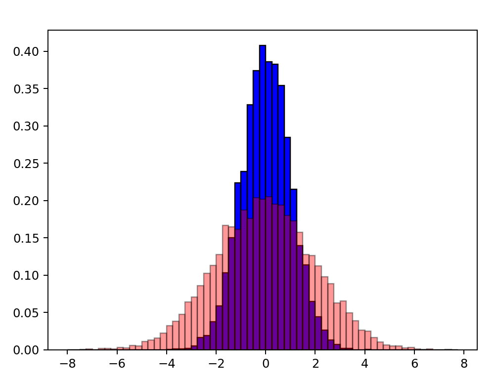
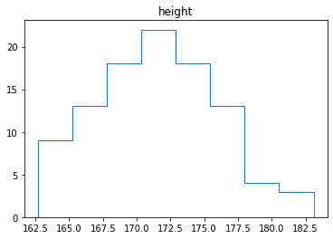
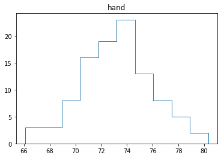

### 参考サイト  
- Pythonnによる統計処理  
[PythonエンジニアによるPython3学習サイト](https://www.python.ambitious-engineer.com/archives/category/application/data_analysis)  
  
- 統計学  
[統計WEB](https://bellcurve.jp/statistics/)

### 参考サイト  
- Pythonnによる統計処理  
[PythonエンジニアによるPython3学習サイト](https://www.python.ambitious-engineer.com/archives/category/application/data_analysis)  
  
- 統計学  
[統計WEB](https://bellcurve.jp/statistics/)


```python
import pandas as pd
import numpy as np
import matplotlib.pyplot as plt
from scipy import stats
```

## データのばらつきに関する統計量
>平均値や中央値など中心が同じでもばらつきが異なる2つのデータ



## 分散  
各データの値が平均値からどのくらい離れているか、各データ値の平均との差を求めて2乗した後、更にその合計の平均値を出したもの  
平均との差は正負が入り混じっているため、2乗して正に数に統一する
  
言葉にするとややこしい

### 実際に算出してみる  
サンプルデータ：ある男子中学校の体型データ(ネットで拾った)
- height:身長
- weight:体重
- hand_length:手掌の長さ


```python
df = pd.read_csv('excel_data01mod.csv')
df
```


<div>
<style scoped>
    .dataframe tbody tr th:only-of-type {
        vertical-align: middle;
    }

    .dataframe tbody tr th {
        vertical-align: top;
    }

    .dataframe thead th {
        text-align: right;
    }
</style>
<table border="1" class="dataframe">
  <thead>
    <tr style="text-align: right;">
      <th></th>
      <th>height</th>
      <th>weight</th>
      <th>hand_length</th>
    </tr>
  </thead>
  <tbody>
    <tr>
      <th>0</th>
      <td>170.9</td>
      <td>66.1</td>
      <td>74.1</td>
    </tr>
    <tr>
      <th>1</th>
      <td>175.1</td>
      <td>60.9</td>
      <td>73.6</td>
    </tr>
    <tr>
      <th>2</th>
      <td>170.7</td>
      <td>71.5</td>
      <td>77.7</td>
    </tr>
    <tr>
      <th>3</th>
      <td>171.7</td>
      <td>51.8</td>
      <td>75.6</td>
    </tr>
    <tr>
      <th>4</th>
      <td>170.8</td>
      <td>58.2</td>
      <td>73.3</td>
    </tr>
    <tr>
      <th>...</th>
      <td>...</td>
      <td>...</td>
      <td>...</td>
    </tr>
    <tr>
      <th>95</th>
      <td>169.8</td>
      <td>63.2</td>
      <td>73.8</td>
    </tr>
    <tr>
      <th>96</th>
      <td>165.8</td>
      <td>55.0</td>
      <td>69.3</td>
    </tr>
    <tr>
      <th>97</th>
      <td>166.8</td>
      <td>58.8</td>
      <td>70.4</td>
    </tr>
    <tr>
      <th>98</th>
      <td>178.8</td>
      <td>69.0</td>
      <td>74.9</td>
    </tr>
    <tr>
      <th>99</th>
      <td>167.5</td>
      <td>58.7</td>
      <td>73.0</td>
    </tr>
  </tbody>
</table>
<p>100 rows × 3 columns</p>
</div>


>ヒストグラム作成


```python
height = np.array(df["height"])
weight = np.array(df["weight"])
hand_length = np.array(df["hand_length"])

fig1 = plt.figure()
fig2 = plt.figure()
fig3 = plt.figure()

# 描画領域の設定
ax1 = fig1.add_subplot(1, 1, 1)
ax2 = fig2.add_subplot(1, 1, 1)
ax3 = fig3.add_subplot(1, 1, 1)

# グラフタイトル
ax1.set_title('height')
ax2.set_title('weight')
ax3.set_title('hand')

ax1.hist(height, bins="auto",  histtype='step')
ax2.hist(weight, bins="auto",  histtype='step')
ax3.hist(hand_length, bins="auto",  histtype='step')
# グラフ描写
plt.show()

# 分散を算出
print("身長の分散:" + str(round(np.var(height),2)) + "cm^2")
print("体重の分散:" + str(round(np.var(weight),2))+ "cm^2")
print("手掌の長さの分散:" + str(round(np.var(hand_length),2)) + "cm^2")
```


    

    


    

    


    

    


    身長の分散:20.46cm^2
    体重の分散:41.89cm^2
    手掌の長さの分散:7.56cm^2


#### 分散だと差が2乗されててイメージしにくい...
  
## 標準偏差  

分散の平方を求める


```python
print("身長の標準偏差:±" + str(round(np.std(height),2)) + "cm")
print("体重の分標準偏差:±" + str(round(np.std(weight),2))+ "cm")
print("手掌の長さの標準偏差:±" + str(round(np.std(hand_length),2)) + "cm")
```

    身長の標準偏差:±4.52cm
    体重の分標準偏差:±6.47cm
    手掌の長さの標準偏差:±2.75cm


### 標準偏差が一番小さいから手掌の長さが一番ばらつきが少ない？  
分散や標準偏差はデータの大きさに依存するためこの結論は不適切
異なるデータに対しては単純に標準偏差でばらつきを評価することが適切でない

### 変動係数

標準偏差を平均値で割る


もともとの大きさ(平均値)に対する相対的な値となるので、データが異なっても比較可能


```python
# 変動係数はnumpyではなくscipyを使用する
print("身長の変動係数:" + str(round(stats.variation(height),2)))
print("体重の変動係数:" + str(round(stats.variation(weight),2)))
print("手掌の長さの変動係数:" + str(round(stats.variation(hand_length),2)))
```

    身長の変動係数:0.03
    体重の変動係数:0.11
    手掌の長さの変動係数:0.04


#### もとの数値の大きさを加味すると身長の方がばらつきが少ない
